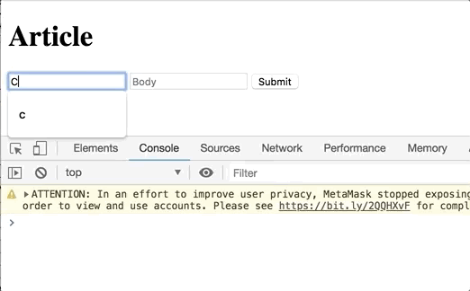

# form-data

## install
```bash
$ docker run --rm -v $(pwd):/app -w /app node:latest npm install
```

## build
```bash
$ docker run --rm -v $(pwd):/app -w /app node:latest npm run build
```

## serve
```bash
$ docker run --rm -v $(pwd):/app -p 8000:8000 -w /app python:latest python -m http.server 8000
 ```

## use

Thanks to [jsonplaceholder](https://github.com/typicode/jsonplaceholder) you can create a fake Article by *POST REQUEST* using the form.

```
const formData = new FormData(form);

const data = {
    userId: 1
};

formData.forEach((value, key) => {
        data[key] = value;
});

console.log(JSON.stringify(data));

fetch('https://jsonplaceholder.typicode.com/posts', {
    method: 'POST',
    body: JSON.stringify(data)
})
.then(response => response.json())
.then(json => console.log(json))

```


As a caveat - this is a living doc, and will evolve as priorities grow and shift. The *vito-learn-react project* will always be adapting to new vito studies.
